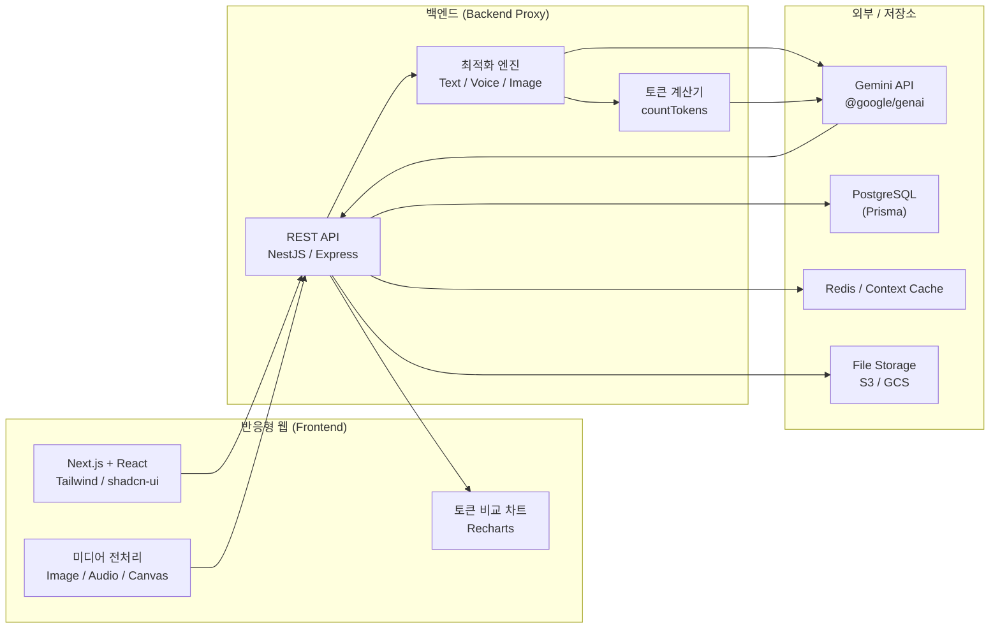
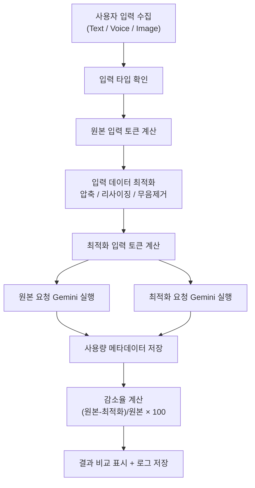

# Gemini Token Optimizer Web

생성형 AI **Gemini API** 의 **Text · Voice · Image** 기능을 반응형 웹에서 테스트하고,
입력/출력 **토큰 사용량을 측정 및 감소**시키는 웹 애플리케이션입니다.

---

## 1. 구성 흐름도

### 1.1 시스템 아키텍처

### 1.2 토큰 최적화 처리 흐름

---

## 2. 기능 설명 (5줄 요약)

1. **Text 최적화** — 프롬프트의 공백/중복/불필요한 예시를 제거하고 출력 형식을 제한해 입력·출력 토큰을 줄입니다.
2. **Voice 최적화** — 무음 구간 제거·압축·구간 선택·전사 요약본 재사용으로 오디오 입력 토큰을 줄입니다.
3. **Image 최적화** — 리사이징·압축·WebP 변환·관심영역 크롭·OCR 추출로 이미지 입력 토큰을 줄입니다.
4. **측정 & 비교** — 원본 대비 최적화 결과의 입력/출력/전체 토큰과 감소율을 실시간으로 비교·시각화합니다.
5. **반응형 & 통계** — PC·태블릿·모바일에서 동일하게 테스트하며, 사용자/관리자별 사용량과 비용 추정을 대시보드로 제공합니다.

---

## 3. 기능 번호 설명 및 하위 카테고리 설명

### 3.1 Text 토큰 최적화 기능
입력한 텍스트 프롬프트를 Gemini API 전송 전에 토큰 수를 계산하고, 프롬프트를 최적화하여 토큰 사용량을 감소시킵니다.

- **입력/측정**: 사용자 프롬프트 입력, 시스템 프롬프트 입력, 원본 프롬프트 토큰 수 계산
- **최적화 생성**: 최적화 프롬프트 자동 생성, 최적화 후 토큰 수 계산, 원본/최적화 응답 비교
- **감소 전략**: 중복 문장 제거, 불필요한 예시 제거, 대화 이력 최근 N개 유지·요약, RAG Top-K 첨부, 출력 형식 제한(JSON/bullet), 최대 출력 토큰 제한, Context Cache(공통 Prefix 고정)
- **테스트 항목**: 원본/최적화 프롬프트·응답 토큰 수, 전체 감소율, 응답 시간, 응답 품질 점수, 캐시 적중 여부, 예상 비용 감소율

### 3.2 Voice / Audio 토큰 최적화 기능
업로드·녹음한 음성 파일을 전송 전 전처리하여 오디오 입력 토큰을 줄이고 전사·요약·분석 결과를 비교합니다.

- **입력/녹음**: 마이크 녹음, 파일 업로드, 미리듣기, 길이·크기 측정, 파형 표시
- **전처리**: 무음 구간 제거, 잡음 제거, 오디오 압축, 긴 오디오 분할(chunk), 필요한 구간만 선택
- **감소 전략**: 앞뒤/긴 무음 제거, 선택 구간만 전송, 1차 전사 요약본 재사용, 고정 안내 프롬프트 캐싱, Files API 업로드 결과 재사용, 서버 측 압축
- **테스트 항목**: 원본/전처리 후 길이·파일 크기·입력 토큰 수, 전사·요약 결과, 토큰 감소율, 처리/응답 시간, 분석 정확도

### 3.3 Image 토큰 최적화 기능
업로드한 이미지를 전송 전 리사이징·압축·크롭·ROI 선택으로 이미지 입력 토큰을 줄이고 분석 결과를 비교합니다.

- **입력/미리보기**: 이미지 업로드, 드래그 앤 드롭, 원본/최적화 미리보기, 크기·해상도·용량 확인
- **전처리**: 리사이징(384px 썸네일 / 768px 기준), 압축, 포맷 변환(WebP/JPEG), 관심영역 크롭, 배경 제거
- **감소 전략**: 분석 목적별 최소 해상도, 텍스트 핵심 시 OCR 후 텍스트만 전송, 동일 이미지 파일 URI·캐시 재사용, 썸네일 선분석 후 필요 시 원본 전송, 이미지 생성 개수 제한
- **테스트 항목**: 원본/최적화 해상도·파일 크기·입력 토큰 수, 분석·OCR·생성 결과 비교, 토큰 감소율, 응답 시간, 품질 점수

### 3.4 측정 · 비교 · 시각화
모든 테스트의 토큰 사용량을 기록하고 최적화 전/후를 비교합니다.

- **토큰 관리**: 입력 전 토큰 계산, 응답 후 실제 사용량 저장(Prompt/Output/Total/Cached), 감소율·모델별 평균 계산
- **시각화**: 토큰 사용량 비교 차트, 감소율 배지, 응답 시간 표시
- **감소율 공식**: `reductionRate = (originalTotalTokens - optimizedTotalTokens) / originalTotalTokens × 100`

### 3.5 대시보드 · 통계
사용자/관리자별 사용량과 비용을 집계합니다.

- **관리자**: 전체 테스트·토큰 수, 평균 감소율(Text/Voice/Image), 모델별·사용자별 사용량, 일자별 사용량·비용 추정 그래프, 최근 로그
- **사용자(Tester)**: 내 테스트 횟수·총 토큰·평균 감소율, 최근 Text/Voice/Image 테스트, 최다 절감 테스트, 저장한 프롬프트

### 3.6 인증 · 권한 · 캐시
- **인증**: 로그인/로그아웃, 내 정보 조회, 비밀번호 변경
- **권한**: `ADMIN`(전체 통계·정책·템플릿 관리) / `TESTER`(테스트·비교·이력)
- **캐시**: Gemini Context Cache 생성·조회·삭제, 공통 배경지식 캐싱으로 적중률 향상

---

## 4. 기술 스택

| 영역 | 사용 기술 |
|---|---|
| Frontend | Next.js(App Router), React, TypeScript, Tailwind CSS, shadcn/ui, Recharts |
| 상태/폼 | Zustand, TanStack Query, React Hook Form, Zod |
| 미디어 | File API, Web Audio API, MediaRecorder, Canvas, Web Worker, browser-image-compression |
| Backend | Node.js, NestJS / Express, TypeScript, `@google/genai`, REST API |
| Database | PostgreSQL(Prisma), Redis, S3 / GCS |
| DevOps | Git, GitHub, Docker, GitHub Actions, Vercel / Cloud Run |

---

## 5. 주요 API 요약

| 그룹 | 대표 엔드포인트 |
|---|---|
| Auth | `POST /api/auth/login`, `GET /api/auth/me` |
| Text | `POST /api/gemini/text/count` · `optimize` · `generate` · `compare` |
| Voice | `POST /api/gemini/voice/upload` · `preprocess` · `transcribe` · `summarize` |
| Image | `POST /api/gemini/image/upload` · `preprocess` · `analyze` · `ocr` · `generate` |
| Usage | `GET /api/usage/summary` · `daily` · `model` · `logs` |
| Cache | `POST /api/cache/context`, `GET /api/cache/context` |
