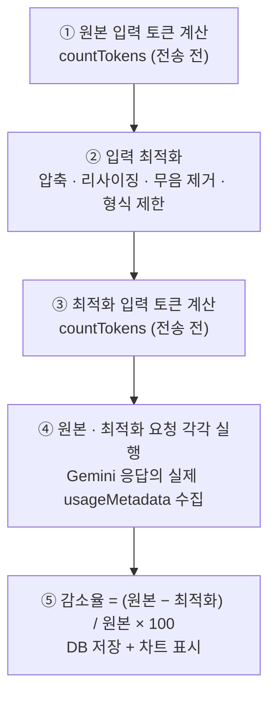
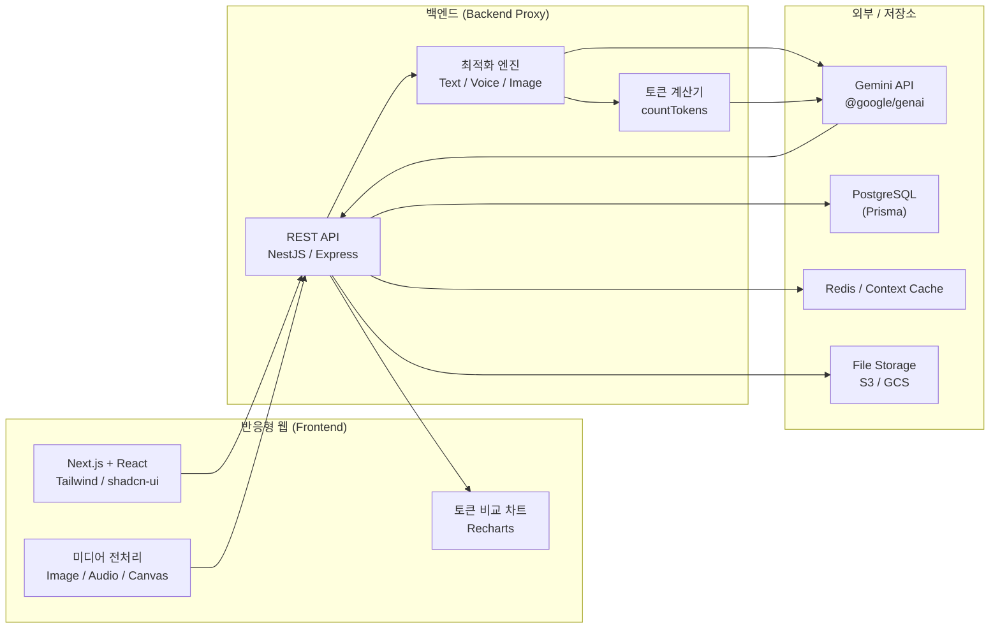
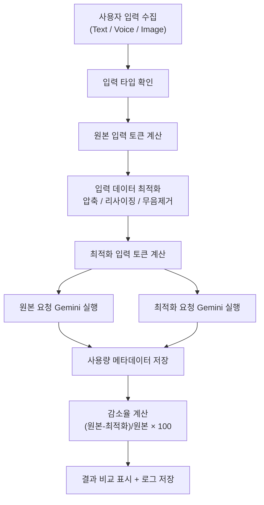

# Gemini Token Optimizer · LLM 비용을 **‘측정하고 증명하는’** 최적화 웹

> 생성형 AI(**Gemini API**) 요청을 보내기 **전에** `Text · Voice · Image` 입력을 최적화하고,
> **원본 대비 토큰이 얼마나 줄었는지를 매 요청마다 실측·시각화**하는 반응형 웹 애플리케이션입니다.
>
> 핵심은 하나입니다 — **“토큰을 줄였다”고 주장하지 않고, 줄어든 양을 숫자로 보여줍니다.**

`Next.js` · `NestJS` · `@google/genai` · `PostgreSQL` · `Redis` · `Docker`

> **제작자 / Author — LEE SEUNG JU**

---

## ⚡ 3줄 요약

> **한 문단도 길다면, 이 세 줄만 읽으세요.**

1. **🔻 보내기 전에 줄인다** — Gemini API 호출 *전에* `Text · Voice · Image` 입력을 자동 최적화(압축·리사이징·무음 제거·형식 제한)해 **근본 비용인 토큰을 낮춘다.**
2. **📏 매 요청마다 실측한다** — *원본*과 *최적화본*을 나란히 실행하고, **Gemini의 실제 `usageMetadata`** 로 감소율을 계산한다 → 추정이 아닌 **증거.**
3. **📊 숫자로 증명한다** — 감소율·비용 추정·응답 시간을 차트와 배지로 시각화해 **“절감했다”를 데이터로 보여준다.**

---

## 목차

1. [한눈에 보기 (TL;DR)](#한눈에-보기-tldr)
2. [왜 필요한가 — 문제 정의](#1-왜-필요한가--문제-정의)
3. [핵심 아이디어 (3줄)](#2-핵심-아이디어-3줄)
4. [어떻게 믿을 수 있나 — 측정 방식](#3-어떻게-믿을-수-있나--측정-방식)
5. [시스템 아키텍처](#4-시스템-아키텍처)
6. [토큰 최적화 처리 흐름](#5-토큰-최적화-처리-흐름)
7. [기능 요약 · 상세](#6-기능-요약-5줄)
8. [기술 스택](#8-기술-스택) · [API 요약](#9-주요-api-요약)
9. [이 프로젝트가 보여주는 것](#10-이-프로젝트가-보여주는-것)

---

## 한눈에 보기 (TL;DR)

| | 내용 |
|---|---|
| **문제** | LLM API 요금은 **토큰 수에 비례**하는데, 대부분 입력을 *원본 그대로* 보내서 비용이 새고, **어디서 얼마나 새는지 알 수도 없다.** |
| **해결** | 요청 전에 입력을 **자동 최적화**(압축·리사이징·무음 제거·형식 제한)하고, **원본 요청과 최적화 요청을 나란히 실행**해 실제 사용량을 비교한다. |
| **증명** | 감소율은 마케팅 문구가 아니라 **Gemini가 돌려준 실제 usage 메타데이터**로 계산 → `(원본 − 최적화) / 원본 × 100`. 매 테스트마다 근거가 남는다. |
| **성과 관점** | 입력만 다듬어도 **이미지 예시 기준 약 60~70% 토큰 절감** 가능 → 사용자 규모가 커질수록 **월 운영비를 유의미하게 절감.** |

---

## 1. 왜 필요한가 — 문제 정의

생성형 AI를 서비스에 붙이면 가장 먼저 부딪히는 벽이 **비용**입니다.

- 💸 **요금 = 토큰 × 단가.** 이미지 한 장, 긴 음성 한 개, 장황한 프롬프트가 그대로 토큰이 되어 청구됩니다.
- 🙈 **어디서 새는지 안 보인다.** “이번 달 AI 요금이 왜 이렇게 나왔지?”를 설명할 데이터가 없습니다.
- 🧱 **최적화는 감(感)으로 한다.** “압축하면 좀 줄겠지”는 있지만, **얼마나** 줄었는지 증명하지 못합니다.

이 프로젝트는 이 세 가지를 **‘보내기 전 최적화 + 전·후 실측 + 시각화’** 로 정면 돌파합니다.

---

## 2. 핵심 아이디어 (3줄)

1. **보내기 전에 줄인다.** — 모델을 호출하기 *전에* 입력(글·음성·이미지)을 다듬어 근본 비용을 낮춥니다.
2. **매번 전/후를 잰다.** — 같은 요청을 *원본*과 *최적화본* 두 번 실행해 실제 토큰 사용량을 직접 비교합니다.
3. **사람이 이해하게 보여준다.** — 감소율·비용 추정·응답 시간을 차트와 배지로 시각화합니다.

> 즉, **‘AI를 쓸 줄 안다’가 아니라 ‘AI를 경제적으로 운영한다’** 를 코드로 증명하는 것이 목표입니다.

---

## 3. 어떻게 믿을 수 있나 — 측정 방식

절감 효과를 신뢰할 수 있는 이유는 **추정이 아니라 실측**이기 때문입니다.

- 계산식: `reductionRate = (originalTotalTokens − optimizedTotalTokens) / originalTotalTokens × 100`
- 저장 항목: `Prompt / Output / Total / Cached` 토큰, 응답 시간, 모델명, 감소율 → **모든 테스트가 로그로 남아 재현·검증 가능.**

### 예상 절감 효과 (예시 시나리오)

> 실제 값은 입력 데이터에 따라 달라지며, 앱에서 **요청마다 실측값을 표시**합니다. 아래는 이해를 돕는 예시입니다.

| 유형 | 원본 | 최적화 | 예시 감소폭 | 대표 기법 |
|---|---|---|---|---|
| 📝 **Text** | 장황한 프롬프트 + 자유 형식 출력 | 중복·예시 제거 + 출력 형식 제한(JSON/bullet) | **~30–50%** | 프롬프트 다이어트, 최대 출력 토큰 제한, Context Cache |
| 🎙️ **Voice** | 60초 오디오(무음·잡음 포함) | 무음 제거 + 필요 구간만 전송 | **~40–60%** | 무음 트리밍, 구간 선택, 전사 요약본 재사용 |
| 🖼️ **Image** | 1024px 원본 이미지 | 512px 리사이징 + WebP 변환 | **~60–70%** | 목적별 최소 해상도, 포맷 변환 / *OCR 후 텍스트만 전송 시 최대 90%+* |

핵심: **입력 품질을 지키는 선에서 토큰만 덜어내므로, 결과 품질은 유지하고 비용만 줄입니다.**

---

## 4. 시스템 아키텍처

> **설계 포인트:** API 키는 프런트에 노출하지 않고 **백엔드 프록시**가 모든 Gemini 호출을 대행합니다. 최적화·토큰 계산·사용량 기록이 서버 한 곳에 모여 **비용 통제와 감사가 가능**합니다.

---

## 5. 토큰 최적화 처리 흐름

---

## 6. 기능 요약 (5줄)

1. **Text 최적화** — 프롬프트의 공백/중복/불필요한 예시를 제거하고 출력 형식을 제한해 입력·출력 토큰을 줄입니다.
2. **Voice 최적화** — 무음 구간 제거·압축·구간 선택·전사 요약본 재사용으로 오디오 입력 토큰을 줄입니다.
3. **Image 최적화** — 리사이징·압축·WebP 변환·관심영역 크롭·OCR 추출로 이미지 입력 토큰을 줄입니다.
4. **측정 & 비교** — 원본 대비 최적화 결과의 입력/출력/전체 토큰과 감소율을 실시간으로 비교·시각화합니다.
5. **반응형 & 통계** — PC·태블릿·모바일에서 동일하게 테스트하며, 사용자/관리자별 사용량과 비용 추정을 대시보드로 제공합니다.

---

## 7. 기능 상세

> 아래 항목은 길어서 **접어 두었습니다.** 필요한 기능을 펼쳐 보세요.

<b>7.1 Text 토큰 최적화</b> — 프롬프트 토큰 계산 · 자동 최적화 · 응답 비교

 

입력한 텍스트 프롬프트를 Gemini API 전송 전에 토큰 수를 계산하고, 프롬프트를 최적화하여 토큰 사용량을 감소시킵니다.

- **입력/측정**: 사용자 프롬프트 입력, 시스템 프롬프트 입력, 원본 프롬프트 토큰 수 계산
- **최적화 생성**: 최적화 프롬프트 자동 생성, 최적화 후 토큰 수 계산, 원본/최적화 응답 비교
- **감소 전략**: 중복 문장 제거, 불필요한 예시 제거, 대화 이력 최근 N개 유지·요약, RAG Top-K 첨부, 출력 형식 제한(JSON/bullet), 최대 출력 토큰 제한, Context Cache(공통 Prefix 고정)
- **테스트 항목**: 원본/최적화 프롬프트·응답 토큰 수, 전체 감소율, 응답 시간, 응답 품질 점수, 캐시 적중 여부, 예상 비용 감소율

<b>7.2 Voice / Audio 토큰 최적화</b> — 무음 제거 · 압축 · 전사/요약 비교

 

업로드·녹음한 음성 파일을 전송 전 전처리하여 오디오 입력 토큰을 줄이고 전사·요약·분석 결과를 비교합니다.

- **입력/녹음**: 마이크 녹음, 파일 업로드, 미리듣기, 길이·크기 측정, 파형 표시
- **전처리**: 무음 구간 제거, 잡음 제거, 오디오 압축, 긴 오디오 분할(chunk), 필요한 구간만 선택
- **감소 전략**: 앞뒤/긴 무음 제거, 선택 구간만 전송, 1차 전사 요약본 재사용, 고정 안내 프롬프트 캐싱, Files API 업로드 결과 재사용, 서버 측 압축
- **테스트 항목**: 원본/전처리 후 길이·파일 크기·입력 토큰 수, 전사·요약 결과, 토큰 감소율, 처리/응답 시간, 분석 정확도

<b>7.3 Image 토큰 최적화</b> — 리사이징 · 압축 · 크롭 · OCR

 

업로드한 이미지를 전송 전 리사이징·압축·크롭·ROI 선택으로 이미지 입력 토큰을 줄이고 분석 결과를 비교합니다.

- **입력/미리보기**: 이미지 업로드, 드래그 앤 드롭, 원본/최적화 미리보기, 크기·해상도·용량 확인
- **전처리**: 리사이징(384px 썸네일 / 768px 기준), 압축, 포맷 변환(WebP/JPEG), 관심영역 크롭, 배경 제거
- **감소 전략**: 분석 목적별 최소 해상도, 텍스트 핵심 시 OCR 후 텍스트만 전송, 동일 이미지 파일 URI·캐시 재사용, 썸네일 선분석 후 필요 시 원본 전송, 이미지 생성 개수 제한
- **테스트 항목**: 원본/최적화 해상도·파일 크기·입력 토큰 수, 분석·OCR·생성 결과 비교, 토큰 감소율, 응답 시간, 품질 점수

<b>7.4 측정 · 비교 · 시각화</b> — 실제 사용량 기록 · 감소율 차트

 

모든 테스트의 토큰 사용량을 기록하고 최적화 전/후를 비교합니다.

- **토큰 관리**: 입력 전 토큰 계산, 응답 후 실제 사용량 저장(Prompt/Output/Total/Cached), 감소율·모델별 평균 계산
- **시각화**: 토큰 사용량 비교 차트, 감소율 배지, 응답 시간 표시
- **감소율 공식**: `reductionRate = (originalTotalTokens - optimizedTotalTokens) / originalTotalTokens × 100`

<b>7.5 대시보드 · 통계</b> — 관리자/사용자별 사용량·비용 집계

 

사용자/관리자별 사용량과 비용을 집계합니다.

- **관리자**: 전체 테스트·토큰 수, 평균 감소율(Text/Voice/Image), 모델별·사용자별 사용량, 일자별 사용량·비용 추정 그래프, 최근 로그
- **사용자(Tester)**: 내 테스트 횟수·총 토큰·평균 감소율, 최근 Text/Voice/Image 테스트, 최다 절감 테스트, 저장한 프롬프트

<b>7.6 인증 · 권한 · 캐시</b> — 로그인 · 역할 관리 · Context Cache

 

- **인증**: 로그인/로그아웃, 내 정보 조회, 비밀번호 변경
- **권한**: `ADMIN`(전체 통계·정책·템플릿 관리) / `TESTER`(테스트·비교·이력)
- **캐시**: Gemini Context Cache 생성·조회·삭제, 공통 배경지식 캐싱으로 적중률 향상

---

## 8. 기술 스택

| 영역 | 사용 기술 |
|---|---|
| Frontend | Next.js(App Router), React, TypeScript, Tailwind CSS, shadcn/ui, Recharts |
| 상태/폼 | Zustand, TanStack Query, React Hook Form, Zod |
| 미디어 | File API, Web Audio API, MediaRecorder, Canvas, Web Worker, browser-image-compression |
| Backend | Node.js, NestJS / Express, TypeScript, `@google/genai`, REST API |
| Database | PostgreSQL(Prisma), Redis, S3 / GCS |
| DevOps | Git, GitHub, Docker, GitHub Actions, Vercel / Cloud Run |

---

## 9. 주요 API 요약

| 그룹 | 대표 엔드포인트 |
|---|---|
| Auth | `POST /api/auth/login`, `GET /api/auth/me` |
| Text | `POST /api/gemini/text/count` · `optimize` · `generate` · `compare` |
| Voice | `POST /api/gemini/voice/upload` · `preprocess` · `transcribe` · `summarize` |
| Image | `POST /api/gemini/image/upload` · `preprocess` · `analyze` · `ocr` · `generate` |
| Usage | `GET /api/usage/summary` · `daily` · `model` · `logs` |
| Cache | `POST /api/cache/context`, `GET /api/cache/context` |

---

## 10. 이 프로젝트가 보여주는 것

- **비용 감각**: 기능을 ‘만드는 것’을 넘어 **‘싸게 운영하는 법’** 까지 설계했습니다.
- **측정 기반 의사결정**: 절감을 주장하지 않고 **숫자로 증명**합니다. (`countTokens` + 실제 usageMetadata)
- **풀스택 실행력**: 미디어 전처리(프런트) → 최적화·프록시(백엔드) → 저장·통계(데이터)까지 한 흐름으로 구현했습니다.

---

제작자 / Author — **LEE SEUNG JU** · antleorkfl00@naver.com · github.com/Leeseungju1991
